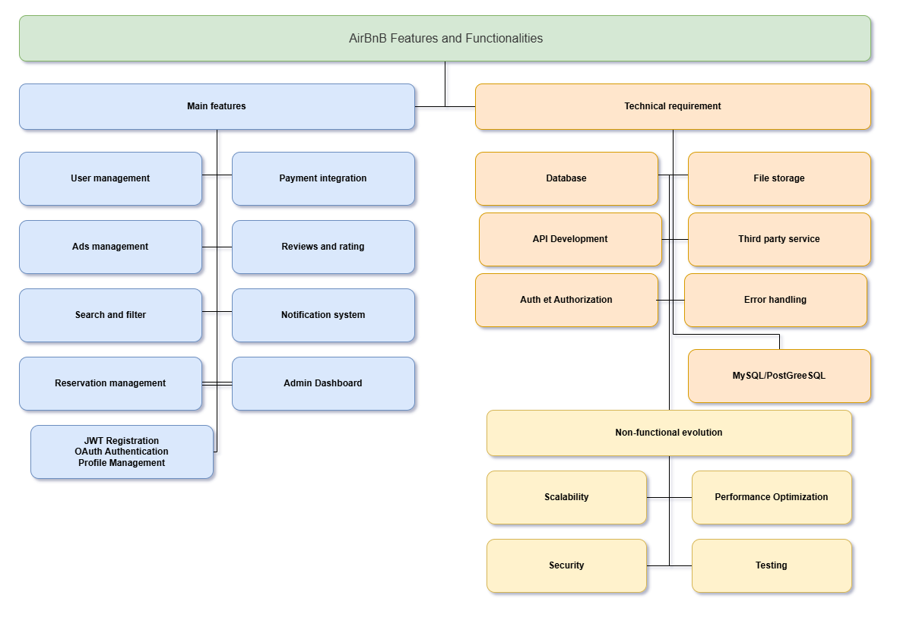

# Fonctionnalités et Architecture du Clone Airbnb

Ce document décrit les fonctionnalités principales et les exigences techniques nécessaires pour le backend du projet Clone Airbnb.

## Vue d'ensemble

Le Clone Airbnb est une plateforme de location de logements qui permet aux utilisateurs de s'inscrire en tant qu'hôtes ou invités, de publier des annonces de logements, d'effectuer des réservations et des paiements en ligne. Le système comprend également des fonctionnalités de recherche avancée, d'évaluation et de communication entre utilisateurs.

## Fonctionnalités Principales

### 1. Gestion des Utilisateurs
- **Inscription**: Système d'enregistrement sécurisé avec JWT
- **Authentification**: Login par email/mot de passe et OAuth (Google, Facebook)
- **Gestion de Profil**: Mise à jour des informations personnelles et photos de profil

### 2. Gestion des Annonces
- **Création d'annonces**: Les hôtes peuvent ajouter des annonces détaillées avec titre, description, localisation, prix, équipements et disponibilités
- **Modification/Suppression**: Possibilité de mettre à jour ou supprimer des annonces existantes

### 3. Recherche et Filtrage
- **Recherche avancée**: Par localisation, fourchette de prix, nombre d'invités
- **Filtres**: Par équipements (Wi-Fi, piscine, animaux autorisés, etc.)
- **Pagination**: Pour gérer les grands ensembles de résultats

### 4. Gestion des Réservations
- **Création de réservation**: Sélection de dates avec validation pour éviter les double-réservations
- **Annulation**: Processus basé sur la politique d'annulation
- **Suivi de statut**: Gestion des réservations (en attente, confirmées, annulées, terminées)

### 5. Intégration des Paiements
- **Passerelles de paiement**: Intégration sécurisée avec Stripe ou PayPal
- **Paiements anticipés**: Gestion des paiements par les invités
- **Versements automatiques**: Aux hôtes après la confirmation de séjour
- **Multi-devises**: Support de différentes monnaies

### 6. Avis et Évaluations
- **Système d'avis**: Les invités peuvent laisser des avis sur les logements
- **Réponses**: Les hôtes peuvent répondre aux avis
- **Vérification**: Liaison des avis aux réservations pour éviter les abus

### 7. Système de Notifications
- **Alertes Email**: Pour les confirmations, annulations et mises à jour de paiement
- **Notifications In-App**: Pour une communication en temps réel

### 8. Tableau de Bord Admin
- **Gestion utilisateurs**: Supervision des comptes utilisateurs
- **Surveillance**: Des annonces, réservations et paiements

## Exigences Techniques

### 1. Gestion de Base de Données
- **Base de données relationnelle**: PostgreSQL ou MySQL
- **Tables principales**: Utilisateurs, Propriétés, Réservations, Avis, Paiements

### 2. Développement API
- **API RESTful**: Méthodes HTTP appropriées (GET, POST, PUT/PATCH, DELETE)
- **GraphQL** (optionnel): Pour les scénarios complexes de récupération de données

### 3. Authentification et Autorisation
- **JWT**: Pour la gestion sécurisée des sessions
- **Contrôle d'accès basé sur les rôles**: Différenciation des permissions entre invités, hôtes et administrateurs

### 4. Stockage de Fichiers
- **Stockage des médias**: Pour les photos de propriétés et profils utilisateurs

### 5. Services Tiers
- **Service d'email**: SendGrid ou Mailgun pour les notifications

### 6. Gestion d'Erreurs
- **Gestion globale des erreurs** pour les API

## Exigences Non-Fonctionnelles

### 1. Évolutivité
- **Architecture modulaire**: Pour faciliter l'évolutivité
- **Scaling horizontal**: Utilisation d'équilibreurs de charge

### 2. Sécurité
- **Chiffrement**: Des données sensibles (mots de passe, informations de paiement)
- **Protection**: Pare-feu et limitation de débit pour prévenir les activités malveillantes

### 3. Optimisation de Performance
- **Mise en cache**: Utilisation de Redis pour améliorer les temps de réponse
- **Optimisation des requêtes**: Pour réduire la charge serveur

### 4. Tests
- **Tests unitaires et d'intégration**: Avec des frameworks comme pytest
- **Tests API automatisés**: Pour garantir le bon fonctionnement des endpoints

---

Ce document sert de référence pour le développement du backend du Clone Airbnb et assure que toutes les fonctionnalités et exigences sont clairement définies et comprises par l'équipe de développement.