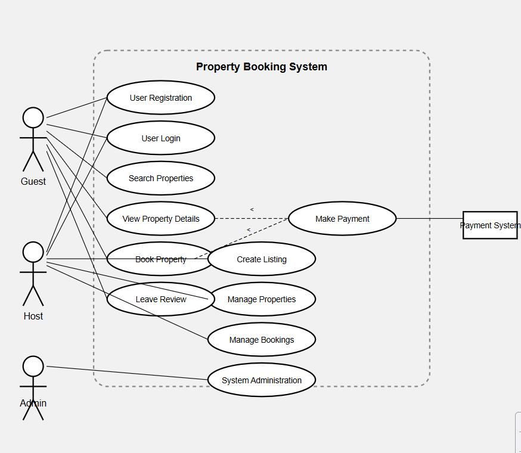

# Documentation du Projet ALX Airbnb

Ce dépôt contient la documentation complète pour notre clone Airbnb développé dans le cadre du projet ALX. Il s'agit d'une plateforme de réservation de propriétés qui permet aux utilisateurs de rechercher, réserver et payer pour des hébergements, ainsi qu'aux propriétaires de lister et gérer leurs biens.

## Structure du Projet

```
alx-airbnb-project-documentation/
├── use-case-diagram/       # Diagrammes de cas d'utilisation
│   └── image.png  # Diagramme principal du système de réservation
|   └── README.md         
└── ...                     # Autres documents et diagrammes à venir
```

## Diagramme de Cas d'Utilisation



Le diagramme de cas d'utilisation montre les interactions principales entre les différents acteurs et le système de réservation de propriétés. Les acteurs incluent:

- **Invités (Guests)**: Utilisateurs cherchant à réserver des propriétés
- **Hôtes (Hosts)**: Propriétaires qui publient leurs biens
- **Administrateurs**: Gestionnaires du système
- **Système de Paiement**: Service externe de traitement des paiements

### Fonctionnalités Principales

1. **Inscription et Authentification**
   - Inscription des utilisateurs
   - Connexion des utilisateurs

2. **Gestion des Propriétés**
   - Recherche de propriétés
   - Consultation des détails d'une propriété
   - Création d'annonces (pour les hôtes)
   - Gestion des propriétés (pour les hôtes)

3. **Système de Réservation**
   - Réservation de propriétés
   - Gestion des réservations
   - Paiements
   - Évaluations et commentaires

4. **Administration**
   - Gestion du système par les administrateurs

